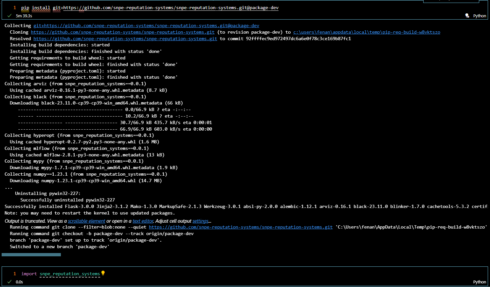

# SNPE Reputation Systems

WIP

## Packaging

The packaging of our project is managed by the continuous integration (CI) pipeline set up in GitHub Actions, which creates a Python package using Poetry. This is detailed within the `build-and-publish-package` job of our workflow file.

### Workflow

Upon a push or pull request to the `main` branch, the CI pipeline runs several jobs, with packaging occurring after successful code formatting checks and code testing. The `build-and-publish-package` job involves:

1. **Checkout Repository**: Checks out the current repository.
2. **Set Up Python**: Sets up the specified Python version.
3. **Install Poetry**: Installs Poetry, our packaging tool.
4. **Build Package**: Executes `poetry build` to create the package.
5. **Publish Package as Artifact**: The built package is published as an artifact within the workflow.

### pyproject.toml Configuration

The `pyproject.toml` file is the primary configuration file for managing project dependencies, package metadata, and the build system via Poetry. Here’s a breakdown of its key sections:

[tool.poetry]: Specifies the package name, version, description, authors, and other metadata. This information is used for identifying the package and its purpose when published.

[tool.poetry.dependencies]: Lists the required packages and versions needed for our package to function properly. We use the caret (^) symbol to allow updates that do not break semantic versioning and asterisks (*) for dependencies to get the latest version. Specific versions of numpy are pinned to prevent issues with newer versions.

[tool.poetry.group.test.dependencies]: Defines dependencies needed for testing but not for the actual package use, like pytest and hypothesis. These are separated into their own group so they can be installed only when needed.

[build-system]: Designates poetry-core as the build backend, making it responsible for packaging and distribution.

The configuration ensures that the package is built with the correct dependencies and metadata, following the Python packaging standards.

### Docker Environment for Packaging

The Dockerfile included in the project's `self_hosted_runner` directory sets up a controlled environment for running our CI pipeline, including the packaging job. It includes:

- Installation of the required Python version (3.9.16).
- Installation of Poetry, configured to avoid creating virtual environments, which is the typical behavior for CI environments.
- Installation of dependencies like PyTorch, torchvision, torchaudio, and other packages directly via conda and pip, as well as the project's own dependencies via poetry install.
- The Docker environment ensures that our packaging process is performed in a clean, consistent environment, avoiding any discrepancies between development and production builds.

## Installation

The package can be installed using one of the following methods:

### Option 1: Installing from GitHub Artifacts

1. Go to the Actions tab in our GitHub repository.
2. Select the workflow run you want.
3. Download the artifact named snpe_reputation_systems_package from the run.
4. Install the downloaded .whl file using pip with the command: 

```bash
pip install path_to_downloaded_wheel.whl
```

This method is particularly useful when you want to install a specific version of the package that may not be the latest commit on the main branch. It provides fine-grained control over which build to install.

### Option 2: Installing via Git

You can also install the package directly using Git, which will fetch the latest version from the main branch of the repository. The command for this installation is:

```bash
pip install git+https://github.com/snpe-reputation-systems/snpe-reputation-systems.git
```

This method ensures that you are always working with the most recent version of the code that has been pushed to the main branch. It's a good option for those who want to stay up-to-date with the latest developments of the project.

Note: if you are working on a branch, and want to retrieve the latest version pushed to that branch, you should add '@branch-name' at the end of the install command, as seen in the picture below:

